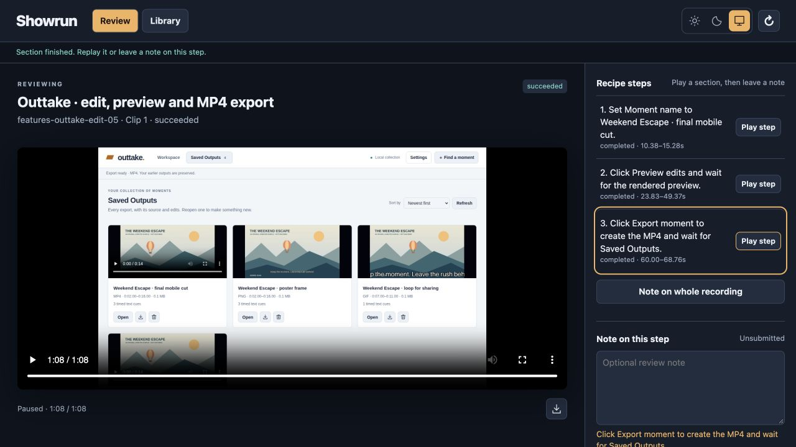

# Showrun

[Website source and preview instructions](site/README.md)

**Show the experience. Keep the footage.**



Showrun helps you and your agent turn an application walkthrough into a recording.
Describe what to demonstrate, prepare the app, and let Showrun operate its real
interface in a separate browser. Review the finished video, jump to a labeled
step, and leave feedback beside the section you are watching.

Show how someone completes a task, compare two app experiences, or demonstrate
entering feedback in a smart tool. Your agent supplies the purpose and starting
material; Showrun performs the walkthrough and retains what actually happened,
including incomplete steps and failed attempts.

## Quick start: bring a demo to your agent

Give your coding agent this message, replacing the example with your own application:

> Use [Showrun](https://github.com/robotdad/amplifier-smart-tool-showrun) to record
> a walkthrough of my prepared app. Read `showrun --help` for setup and usage.
> Demonstrate creating a sample task, assigning it, and finding it in the board.
> Use fictional demo data and agree on the changes the recording may make.
> Open the finished recording in Showrun so I can watch each step and leave notes.

Your agent checks the capture environment, prepares the target and bounded request,
and returns the recording. You can review it in conversation or use Showrun's
review dashboard. No repository checkout is needed to use the tool.

### Before your first recording

Use a coding agent that can install and run local tools. Recording currently
requires **Linux**, Python 3.12+, Git, uv, Chromium, and FFmpeg with FFprobe and
libx264. A Linux VM or container can provide the capture environment on another
host; the prepared application must be reachable from it. Review of retained
recordings also works on macOS and needs no model.

Showrun uses **Amplifier Agent** for its internal navigation decisions and needs
its own explicitly configured OpenAI or Anthropic model access. Your coding
agent's model access is not automatically shared with Showrun. Runtime preparation
may download modules, but does not call a model. Ask your agent to follow the
[installation and provider guidance](src/amplifier_smart_tool_showrun/SMART_TOOL.md#install-and-prerequisites).

You choose the application, permitted interactions, provider disclosures and work
limits. Navigation is the default. Demonstrating edits or submitting feedback
requires explicit permission for those effects; recording an app is not permission
to change anything in it. Prepare authentication and demo content before capture.

### For the agent receiving this link

Install without cloning the repository, then read the tool-owned usage guide:

```sh
uv tool install --python 3.12 git+https://github.com/robotdad/amplifier-smart-tool-showrun
showrun --help
```

Follow that guide to install Chromium in the selected tool environment, prepare
its runtime, and read the capability help for the operations you need.
[`AGENTS.md`](AGENTS.md#using-the-tool-for-a-person) describes the caller workflow.

## What the loop looks like

1. **Prepare.** Your agent supplies a working application, sample data, an ordered
   demo recipe and observable outcomes. The same generic UI operator works with
   prepared web apps and smart-tool dashboards.
2. **Record.** Showrun observes the current interface, performs the authorized
   interactions and holds each result on screen. Capture runs separately from
   your browser tabs.
3. **Watch and comment.** Open a recording in Review. Use the native video controls
   or play a recipe section, then write a note beside that same step. Drafts and
   submitted notes stay attached to the clip and section they describe.
4. **Return and share.** Library organizes retained demos, takes and clips. Sort by
   name or recency, expand grouped recordings, select a name to rename it, or open
   a clip for review. Download the current MP4 or a demo ZIP. Ask your agent for a
   deliberate new take when you want to change the demonstration.

The dashboard supports light, dark and system appearance. Reviewing, commenting
and downloading do not start a new recording or call a model. Tell your agent when
you leave feedback; saving a note does not automatically request a retake.
Closing a browser tab does not stop the dashboard server.

## What to expect

The current recorder captures **silent web video on one surface** using Playwright
and Chromium. Native desktop computer use is a future direction. Showrun does not
create the target app's content, handle login, or edit, narrate or assemble a video
production. Managed startup is available for the initial Stories fixture integration;
other prepared dashboards can be supplied by URL.

A successful interaction check is evidence, not a guarantee of a clear demonstration.
Watch the footage: text size, pacing and the completeness of the task still matter.
Execution, media validity and human acceptance are separate results. Work limits
can end a take early; the retained receipt explains failures and partial results.
The image above is a real review screenshot using fictional sample footage, not a
mockup. See the [generic UI verification notes](docs/generic-ui-verification.md).

MP4 downloads preserve the recording's original bytes. Demo ZIPs include a snapshot
and hash inventory. Deletion is scoped to the selected retained work; execution
receipts and request identities remain protected. See the
[review guide](src/amplifier_smart_tool_showrun/SMART_TOOL.md) for transfer limits,
recovery behavior and exact capabilities.

## Use it in an MCP host

Install the optional adapter:

```sh
uv tool install --python 3.12 'amplifier-smart-tool-showrun[mcp] @ git+https://github.com/robotdad/amplifier-smart-tool-showrun'
```

Register `showrun-mcp --storage /absolute/path/to/takes --workspace default` as a
stdio server. The MCP App and standalone dashboard use the **same review interface**
and library-owned state. The adapter reviews retained recordings; it does not
start capture. App display and downloads depend on host support for MCP Apps,
binary resources and browser downloads.

For a standalone dashboard, run
`showrun --storage /absolute/path/to/takes review serve --workspace default` and
open its one-use access URL. Keep that URL private. Neither review surface needs
provider credentials.

## Developing or contributing?

Clone the repository when you want to work on Showrun itself.
[`AGENTS.md`](AGENTS.md#develop-from-this-checkout) covers setup, tests, architecture
and contribution boundaries. The vision and contracts remain drafts; they describe
intended behavior rather than certify complete implementation.

## Go deeper

- [Agent usage and development workflow](AGENTS.md)
- [Library and CLI operating guide](src/amplifier_smart_tool_showrun/SMART_TOOL.md)
- [Vision](docs/VISION.md)
- [Draft contracts](contracts/README.md) and [review workspace contract](contracts/capture-review.v1.md)
- [Generic UI verification](docs/generic-ui-verification.md)
- [Initial managed integration scope](docs/integrations/initial-scope.md)
